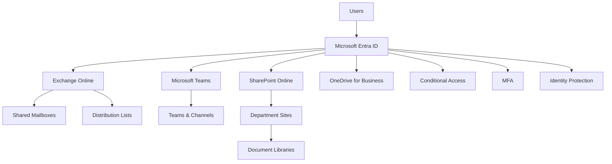

## 1. High-Level Microsoft 365 Architecture

```mermaid {preview="true"}
flowchart TB

    User[Users]

    User --> Entra[Microsoft Entra ID]

    Entra --> Exchange[Exchange Online]
    Entra --> Teams[Microsoft Teams]
    Entra --> SharePoint[SharePoint Online]
    Entra --> OneDrive[OneDrive for Business]

    Exchange --> SharedMailboxes[Shared Mailboxes]
    Exchange --> DLs[Distribution Lists]

    Teams --> TeamsChannels[Teams & Channels]

    SharePoint --> Sites[Department Sites]
    Sites --> Libraries[Document Libraries]

    Entra --> CA[Conditional Access]
    Entra --> MFA[MFA]
    Entra --> IDP[Identity Protection]
```
