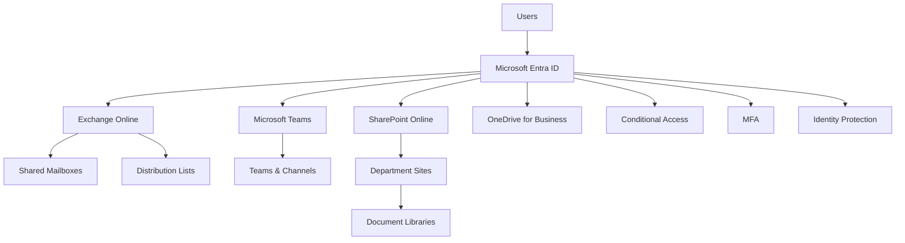
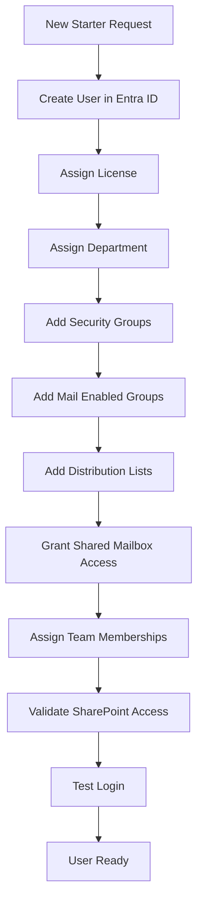
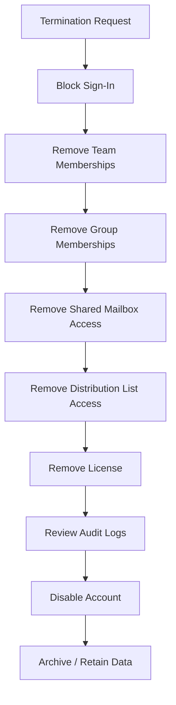

## 1. High-Level Microsoft 365 Architecture

```mermaid {preview="true"}
flowchart TB

    User[Users]

    User --> Entra[Microsoft Entra ID]

    Entra --> Exchange[Exchange Online]
    Entra --> Teams[Microsoft Teams]
    Entra --> SharePoint[SharePoint Online]
    Entra --> OneDrive[OneDrive for Business]

    Exchange --> SharedMailboxes[Shared Mailboxes]
    Exchange --> DLs[Distribution Lists]

    Teams --> TeamsChannels[Teams & Channels]

    SharePoint --> Sites[Department Sites]
    Sites --> Libraries[Document Libraries]

    Entra --> CA[Conditional Access]
    Entra --> MFA[MFA]
    Entra --> IDP[Identity Protection]
```
## 2. User Onboarding Workflow

```mermaid {preview="true"}
flowchart TD

    A[New Starter Request] --> B[Create User in Entra ID]

    B --> C[Assign License]

    C --> D[Assign Department]

    D --> E[Add Security Groups]

    E --> F[Add Mail Enabled Groups]

    F --> G[Add Distribution Lists]

    G --> H[Grant Shared Mailbox Access]

    H --> I[Assign Team Memberships]

    I --> J[Validate SharePoint Access]

    J --> K[Test Login]

    K --> L[User Ready]
```

## 3. User Offboarding Workflow

```mermaid {preview="true"}
flowchart TD

    A[Termination Request]

    A --> B[Block Sign-In]

    B --> C[Remove Team Memberships]

    C --> D[Remove Group Memberships]

    D --> E[Remove Shared Mailbox Access]

    E --> F[Remove Distribution List Access]

    F --> G[Remove License]

    G --> H[Review Audit Logs]

    H --> I[Disable Account]

    I --> J[Archive / Retain Data]
```
